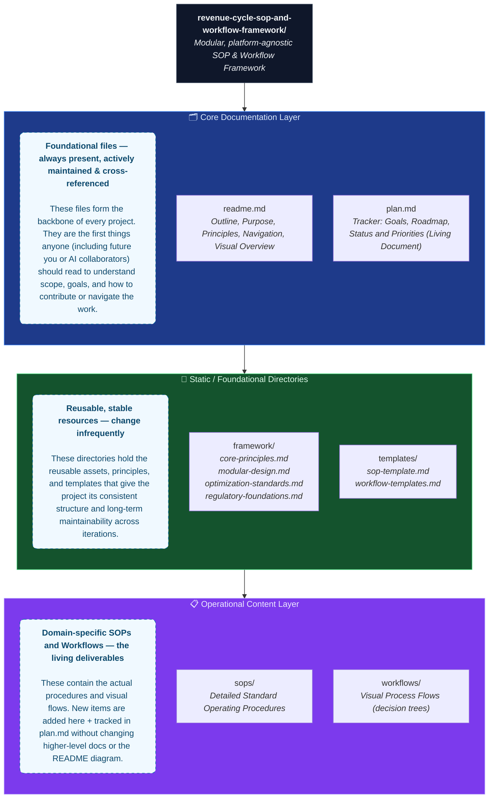

# Revenue Cycle SOP & Workflow Framework

**Status**: In Development  
**Last Updated**: May 2026 (Enhanced for navigation, visual overview, and low-maintenance scaling)  
**Owner**: Shaine Meister  
**Scope**: This framework focuses on revenue cycle management processes and is designed to be adaptable across different healthcare organizations and systems.

## Table of Contents

- [Overview](#overview)
- [Purpose](#purpose)
- [Core Principles](#core-principles)
- [Framework Components](#framework-components)
- [Visual Project Overview](#visual-project-overview)
- [Current Focus Areas](#current-focus-areas)
- [How to Use This Framework](#how-to-use-this-framework)
- [How to Create a New SOP or Workflow (Step-by-Step Process)](#how-to-create-a-new-sop-or-workflow-step-by-step-process)
- [Collaboration & Maintenance](#collaboration--maintenance)
- [Status & Roadmap](#status--roadmap)

## Overview

This repository contains a **modular, platform-agnostic framework** for developing, organizing, and optimizing Standard Operating Procedures (SOPs) and workflows within revenue cycle management.

The goal is to create a reusable system of documentation and process design that can be adapted across different organizations, systems, and roles while maintaining strong alignment with industry standards and regulatory requirements.

## Purpose

The framework exists to:

- Provide a consistent, scalable method for building and maintaining revenue cycle SOPs and workflows.
- Serve as portable intellectual property that can be carried across different companies and platforms.
- Balance operational effectiveness with regulatory compliance and process optimization.
- Create clear separation between high-level strategy, reusable templates, and specific procedural documentation.

## Core Principles

This framework is built on the following foundational ideas:

- **Modularity** — Components can be adapted, extended, or replaced without disrupting the overall system.
- **Clarity & Consistency** — Documentation follows standardized formats to improve readability and maintainability.
- **Regulatory Alignment** — All processes respect industry regulations and compliance requirements.
- **Optimization Focus** — Every SOP and workflow is designed with efficiency, accuracy, and continuous improvement in mind, with emphasis on reducing mental friction and enabling intuitive flow.
- **Portability** — The framework is intentionally designed to be system- and organization-agnostic.

## Framework Components

This project is organized into four main areas:

| Component     | Purpose                                                                 | Location |
|---------------|-------------------------------------------------------------------------|----------|
| **Framework** | Core principles, modular design, regulatory foundations, and optimization standards | [`framework/`](./framework) |
| **Templates** | Reusable templates for creating consistent SOPs and workflows           | [`templates/`](./templates) |
| **SOPs**      | Detailed Standard Operating Procedures for specific revenue cycle areas | [`sops/`](./sops) *(All current SOP documents reside here — no direct file links in this README for maximum scalability)* |
| **Workflows** | Process flows, decision trees, and visual process documentation         | [`workflows/`](./workflows) *(All current Workflow documents reside here — no direct file links in this README for maximum scalability)* |

## Visual Project Overview

A visual representation of the overall project structure helps quickly convey the modular architecture, relationships between components, and the deliberate design for long-term maintainability. 

The diagram provides a clean, simplified tree view of the project’s top-level structure. It shows the main files and folders branching directly from the root in an easy-to-scan layout. This design prioritizes readability and quick comprehension while highlighting the modular organization—core documentation and principles on one side, operational content on the other—without overwhelming detail.

This diagram is created using **Mermaid** syntax, which GitHub natively renders in README files (interactive pan/zoom on supported views). It is fully text-based, version-controlled, and requires **zero external assets or updates** when new SOPs or Workflows are added.

**Key takeaways from the visual structure:**

- **Clear separation of concerns** — Strategy (framework + templates) is decoupled from content (sops + workflows).
- **Centralized tracking** — `plan.md` absorbs all dynamic information (which SOPs exist, their status, priorities, metrics).
- **Scalability by design** — New SOPs or Workflows are added only to their folders + `plan.md`. The README and this diagram remain unchanged.
- **Intuitive flow for contributors** — Templates feed both SOPs and Workflows; everything traces back to the core principles.

This visual approach aligns with the framework’s own “Clarity & Consistency” and “Optimization Focus” principles while making the architecture immediately understandable to humans and AI agents alike.

## Current Focus Areas

Initial development of this framework is centered on establishing a strong foundational structure. The four primary components are being developed in parallel:

- **Framework** — Defining the guiding principles, modular design approach, regulatory foundations, and optimization standards.
- **Templates** — Creating standardized templates to ensure consistency when building new SOPs and workflows.
- **SOPs** — Developing clear, well-structured operating procedures for key revenue cycle functions.
- **Workflows** — Designing visual process flows and decision frameworks that support the SOPs.

**For the complete, up-to-date picture of which specific SOPs and Workflows are Complete, In Progress, or Planned (including Registration, Visit Filing Order, Demand Claims, and future expansions to Billing, Denials, Prior Auth, Coding, etc.):**

→ Refer to the [plan.md](./plan.md) file.  
→ Browse the latest documents directly in the [sops/](./sops) directory and [workflows/](./workflows) directory.

This directory-based approach ensures that as new documents are created or refined, they automatically become available without any changes to this README.

## How to Use This Framework

1. Review the documents in the [framework/](./framework) directory to understand the guiding principles and structure.
2. Use the templates in the [templates/](./templates) directory when creating new SOPs or workflows.
3. Follow the established format and structure when developing content in the [sops/](./sops) directory and [workflows/](./workflows) directory.
4. Maintain version history and clear documentation so processes remain understandable and maintainable over time.

## How to Create a New SOP or Workflow (Step-by-Step Process)

This section provides a clear, repeatable process for creating new content while maintaining full continuity with the framework. Follow these steps in order.

### Step 1: Review the Framework Documents
Before creating any new content, review the relevant sections of the [framework/](./framework) directory to ensure alignment:

- Internalize the philosophy of simplicity, intuitive flow, usability over exhaustiveness, and continuous improvement.
- Understand the **SOP + Companion Workflow** pairing approach.
- Learn how to integrate compliance considerations lightly and appropriately.
- Understand how to design for predictable navigation with minimal mental friction and reduced text volume.

### Step 2: Decide on the Deliverable(s)
- Determine whether you need an **SOP**, a **Workflow**, or **both** (recommended pairing).
  - Create an **SOP** when the process requires documented context, roles, regulatory notes, quality checks, or training value.
  - Create a **Workflow** when the process benefits from a simplified, visual quick-reference for day-to-day use.
  - For most processes, create **both** as companion documents.

### Step 3: Copy the Appropriate Template
- Go to the [templates/](./templates) directory.
- Copy `sop-template.md` if creating an SOP (or `workflow-template.md` if creating a Workflow) from within the templates folder.
- Paste the copy into the target location (`sops/` or `workflows/`) and rename it appropriately (e.g., `registration.md` or `registration-workflow.md`).

### Step 4: Fill in the Content
- Complete each section of the template.
- Keep language concise and focused on essential actions (optimize for predictable navigation with minimal mental friction).
- Include decision points where relevant.
- Add brief regulatory context in the designated section (do not reproduce full regulatory text).
- For Workflows: Keep the Mermaid diagram simple and focused on the main flow.

### Step 5: Add Cross-References
- In the SOP’s “Companion Workflow” section, link to the corresponding Workflow (if one exists).
- In the Workflow’s “Parent SOP” section, link to the corresponding SOP.
- Ensure both documents reference the relevant framework files where appropriate (the templates already include guidance for this).

### Step 6: Update Supporting Files
- Add the new SOP/Workflow to the [plan.md](./plan.md) file with its current status and priority.
- **Important for maintenance scaling**: There is **no need to edit this README.md** when adding or updating SOPs or Workflows. All dynamic tracking lives in `plan.md`, and documents are discovered via the directory links.

### Step 7: Review for Framework Alignment
Before finalizing, perform a quick self-check:
- Does this document align with the Core Principles (especially Simplicity First, Intuitive Flow, and Usability Over Exhaustiveness)?
- Is the text volume minimized while preserving necessary regulatory and procedural integrity?
- Does the document follow the modular structure and template standards?
- If a companion document exists, do the two files clearly reference each other?

### Step 8: Commit and Version
- Commit the new file(s) with a clear message describing what was created.
- Update the Version History table inside the document.
- Update `plan.md` to reflect the new status.

## Collaboration & Maintenance

This framework is being developed collaboratively. High-level direction, feedback, and new content requests are managed through direct communication and issues. All documentation follows the standards defined in this repository to ensure consistency and long-term usability.

**Version history** is maintained through Git. When updating existing documents, changes should be clearly described and dated.

### Maintenance Scaling Design (Low-Effort by Intent)

To keep maintenance of **this README.md** minimal even as the project grows to dozens or hundreds of SOPs and Workflows:

- **No direct links to individual SOP or Workflow documents** — Only directory links (`sops/`, `workflows/`) are used. New files appear automatically in the GitHub folder view.
- **Dynamic content lives in `plan.md`** — Status, priorities, metrics, and the living list of which SOPs/Workflows exist or are in progress are tracked in one dedicated file. This README stays high-level and stable.
- **High-level, evergreen descriptions** — Sections describe philosophy, process, and structure rather than enumerating current files.
- **Mermaid diagram** — The visual overview is text-based and abstract; it never needs updating when content files are added or renamed.
- **Relative links only** — All folder links (e.g. `./sops`) work regardless of branch, fork, or clone — no hard-coded repository paths.

**Result**: Contributors and maintainers can focus almost exclusively on creating excellent SOP/Workflow content and updating the single `plan.md` tracker. This README requires changes only for major philosophical, process, or structural shifts.

Edge cases considered:
- Very large number of SOPs → GitHub folder views and `plan.md` scale gracefully; README does not grow.
- Frequent renames or refactors of individual documents → Only `plan.md` needs updating.
- Multiple contributors or external forks → Relative directory links remain valid everywhere.
- AI agents or automated tooling parsing the README → Clear section structure + Table of Contents + stable high-level text makes reliable navigation and extraction easy.

## Status & Roadmap

This framework is currently in the foundational development phase. The initial focus is on building out the core framework principles, establishing reusable templates, and developing initial SOPs and workflows for key revenue cycle functions.

Future phases may include:
- Expansion into additional revenue cycle areas
- Refinement of optimization and measurement standards
- Development of supporting tools and examples

**Detailed, always-current status** (including exactly which SOPs and Workflows are Complete / In Progress / Planned, their versions, and next priorities) is maintained in the [plan.md](./plan.md) file.

This separation keeps the high-level structure in this README clear and low-maintenance while allowing detailed progress tracking in one central, easy-to-update location.

---

*Thank you for using and contributing to this framework. Your feedback helps us continuously improve both the processes and the documentation itself.*
