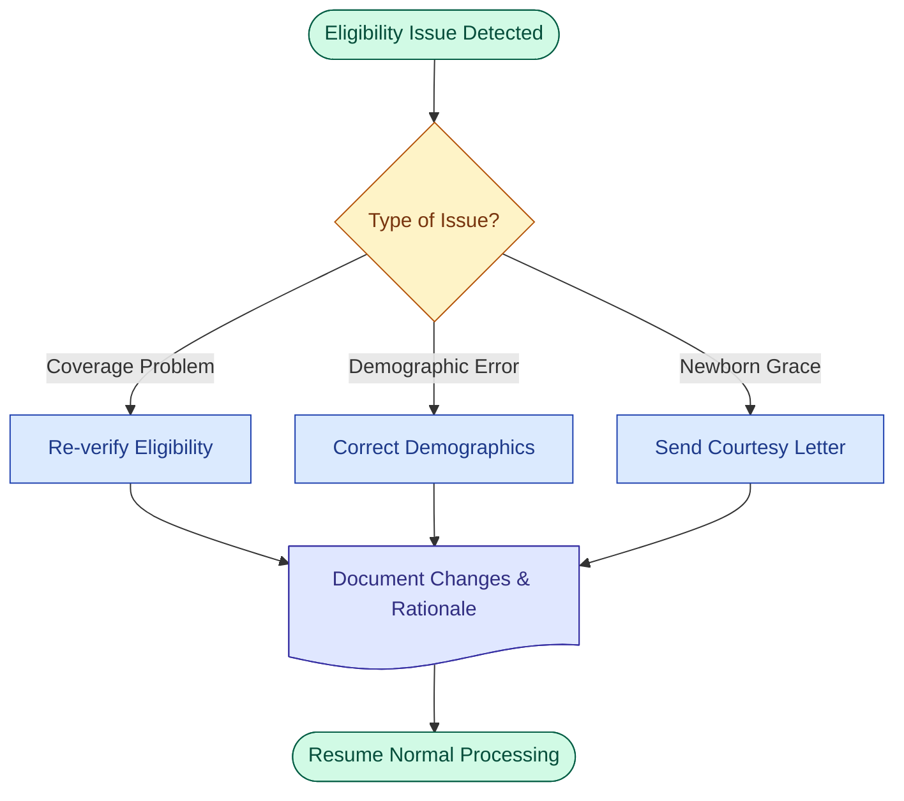
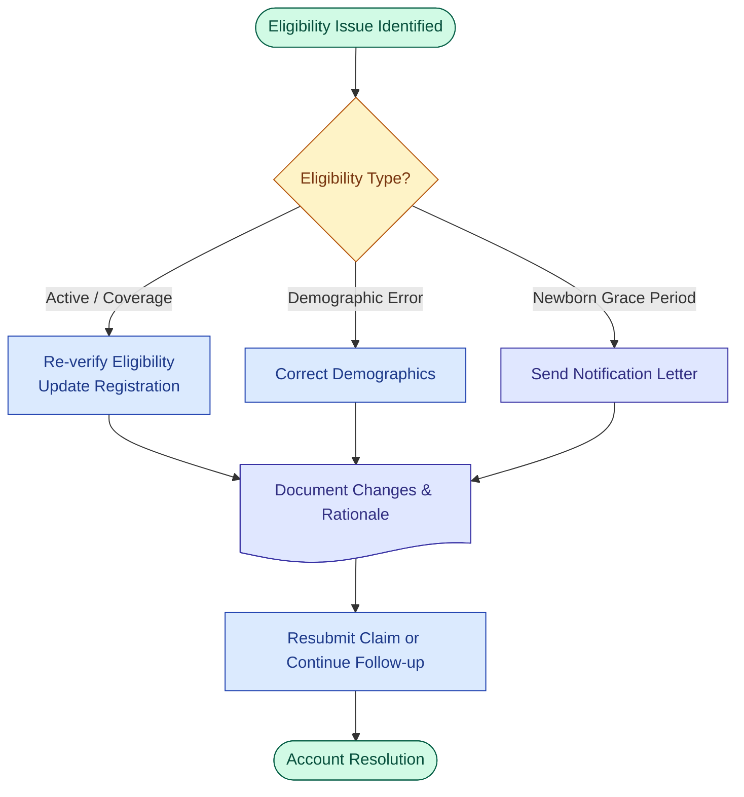
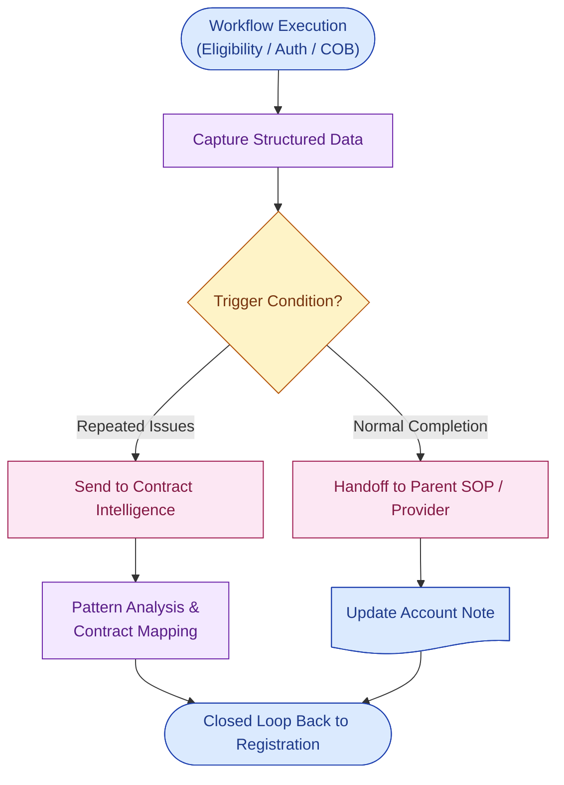

# Mermaid Visualization Standards

**Version**: 1.1  
**Last Updated**: 2026-05-17  
**Owner**: Shaine Meister  
**Status**: Active

> These standards follow the project’s principles of **Clarity & Consistency** and **Optimization Focus** (low mental friction). They are informed by the `mermaid-helper` skill’s type-aware recommendations for SOPs, Workflows, and Feedback Loop sections.

## Type-Specific Diagram Guidance & Examples

Different document types have different visual needs. The guidance below adapts shape selection, complexity, and focus accordingly.

### 1. SOPs (Lightweight & Supportive)

**When to use**: Inside SOP documents for exception handling, key decision points, or quick visual summaries. Keep diagrams minimal so they support (rather than replace) the procedural text.

**Recommended approach** (per `mermaid-helper`):
- Use simple classic or lightly enhanced shapes.
- Focus on 1–2 key decisions or exception paths.
- Prioritize human readability for training and daily execution.

**Example: Exception Handling Decision (for Registration SOP)**

**Why this style?** Lightweight, easy to embed, focuses only on the decision branches most relevant to SOP readers.

### 2. Workflows (Primary Visual Deliverable)

**When to use**: Dedicated workflow files. This is where rich semantic visualization shines.

**Recommended approach** (per `mermaid-helper` + project RCM standards):
- Use modern expanded shapes (`@{ shape: xxx }`) for semantic clarity.
- Apply the full RCM color palette and classes.
- Split complex flows into focused sections (Eligibility, COB, Authorization, etc.).
- Make closed-loop handoffs visually prominent.

**Example: Eligibility Issue Handling (Workflow style)**

**Why this style?** Rich semantics, clear visual hierarchy, and explicit start/end + document shapes — ideal as a day-to-day visual reference.

### 3. Feedback Loop Sections (Analytical / Data-Driven)

**When to use**: The standalone `## Feedback Loop & Data Collection Framework` section at the bottom of SOPs and Workflows. These diagrams should emphasize **data movement, capture points, triggers, and closed loops**.

**Recommended approach** (per `mermaid-helper`):
- More analytical focus.
- Highlight data capture, handoff triggers, destinations (e.g., Contract Intelligence, parent SOP).
- Use shapes that emphasize storage (`datastore`, `cyl`) and data movement.
- Show the closed-loop nature explicitly.

**Example: Closed-Loop Feedback & Handoff Flow**

**Why this style?** Emphasizes data capture → trigger → destination → closed loop. Uses `datastore`-style thinking and handoff coloring to make the analytical/feedback nature clear.

---

## Core Standards (Shapes, Colors, Configuration)

(Keep the existing strong sections on Recommended Node Shapes for RCM, Standardized Configuration & Styling, Best Practices, etc.)

## References

- `mermaid-helper` skill type-aware guidance (SOP / Workflow / Feedback Loop)
- Official Mermaid docs
- Project files: `core-principles.md`, `optimization-standards.md`, `workflow-template.md`

---

## Version History

| Version | Date       | Changes                                      | Author          |
|---------|------------|----------------------------------------------|-----------------|
| 1.0     | 2026-05-17 | Initial release with RCM-aligned shapes      | Shaine Meister  |
| **1.1** | 2026-05-17 | Added type-specific examples (SOP, Workflow, Feedback Loop) using `mermaid-helper` guidance | Shaine Meister  |
