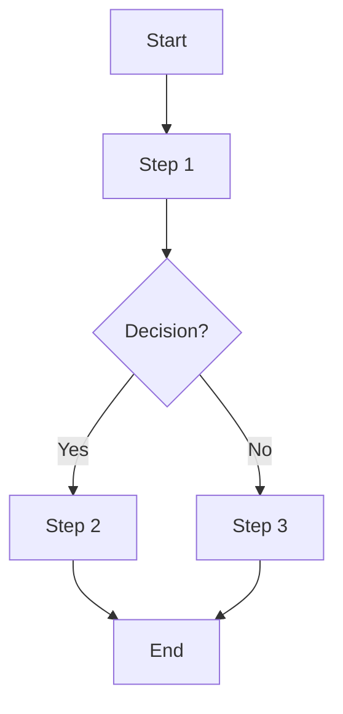

# [Workflow Title]

**Version**: 2.0  
**Last Updated**: 2026-05-16  
**Owner**: Shaine Meister  
**Status**: Draft / In Review / Active

> **Framework Alignment Check**  
> Before finalizing this workflow, evaluate it against the principles in `core-principles.md` (especially Principles 1–4 and 7). Apply modular structure guidance from `modular-structure.md`, integrate regulatory foundations appropriately from `regulatory-foundations.md`, and optimize for predictable navigation with minimal mental friction per `optimization-standards.md`.  
> This workflow is intended as the **simplified, visual quick-reference companion** to its parent SOP (see `modular-structure.md` – Recommended Design Patterns: SOP + Companion Workflow Pairing).

## Process Overview

Keep this to 2–4 sentences maximum. Focus on the end-to-end flow, its purpose, and key outcomes. Be concise.

## Visual Process Flow

Keep the diagram simple and focused on the main flow. Avoid unnecessary complexity or excessive branching unless essential for understanding. Use consistent Mermaid styling (see future workflow-standards guidance).

## Related Documents

- **Parent SOP**: [Link to the corresponding SOP file in `sops/`] — This workflow serves as the simplified visual quick-reference companion to the full authoritative SOP.
- Related Workflows or other supporting documents (if applicable).

**Note**: The companion Workflow is designed for rapid day-to-day use, while the parent SOP remains the detailed procedural authority.

---

## Feedback Loop & Data Collection Framework

> **Purpose of This Section**  
> This section is intentionally separated from operational steps. It serves as the standardized interface and data mapping layer for future autonomous Revenue Cycle Management systems, analytics platforms, RPA tools, and AI-driven decision engines. It enables clean integration without altering core clinical or administrative workflows.

### Data Capture Points (Structured Fields)
- Field 1: `field_name` (type, required/optional) — Description and business rule
- Field 2: ...

### Handoff Triggers & Destinations
- **Trigger**: [Specific condition or event]
  - **Destination**: `target-file.md` + Feedback Layer repository
- **Trigger**: ...

### Contract Intelligence Mapping
- Specific data points useful for legal/contract teams (payer patterns, reimbursement variances, denial root causes linked to contract terms)

### Automation Readiness Notes
- Recommended integration patterns (real-time vs batch)
- Suggested data export format (JSON schema reference)
- Error handling and retry considerations
- Notes on avoiding vendor-specific implementations

---

## Version History

| Version | Date       | Changes                                                                 | Author          |
|---------|------------|-------------------------------------------------------------------------|-----------------|
| 1.0     | [Date]     | Initial version created                                                 | Shaine Meister  |
| 2.0     | 2026-05-16 | Converted to v2 structure with Version History moved to bottom. Added Related Documents section after Visual Process Flow to mirror sop-template.md for consistent cross-referencing and companion relationship clarity. | Shaine Meister  |
