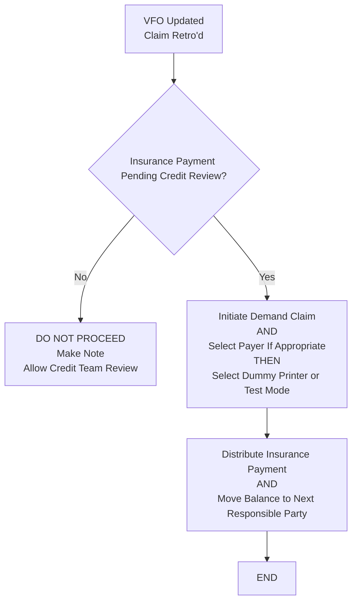

# Demand Claim Workflow

**Version**: 1.2  
**Last Updated**: May 9, 2026  
**Owner**: Shaine Meister  
**Status**: Draft

> **Framework Alignment Check**  
> Before finalizing this workflow, evaluate it against the principles in `core-principles.md` (especially Principles 1–4 and 7). Apply modular structure guidance from `modular-structure.md`, integrate regulatory foundations appropriately from `regulatory-foundations.md`, and optimize for predictable navigation with minimal mental friction per `optimization-standards.md`.  
> This workflow is the **simplified, visual quick-reference companion** to the Demand Claim SOP.

## Process Overview

This workflow provides a streamlined process for handling **Demand Claims** triggered by VFO updates and retro claims. It emphasizes the critical insurance payment pending credit review gate to prevent improper actions.

## Visual Process Flow

**Key Decision Points**
- Is there an Insurance Payment Pending Credit Review?
- Has the VFO been updated and claim retro'd?

**Critical Validation Notes**
- Only proceed if payment is pending credit review.
- Demand Claims are high-impact actions — always ensure proper sequencing.

**Notes / Tips**
- Use this workflow immediately after VFO updates that trigger retro claims.
- Coordinate with Credit Team when payment review is pending.
- Document all actions thoroughly.
- Adapt system-specific steps (e.g. Dummy Printer) to your organization's equivalent process or tool.

## Parent / Related Documents

- **Parent SOP**: [demand-claim.md](../sops/demand-claim.md)
- **Related Processes**: [Visit Filing Order SOP & Workflow](../sops/visit-filing-order.md) (main trigger) and [visit-filing-order-workflow.md](../workflows/visit-filing-order-workflow.md)

## Version History

| Version | Date       | Changes                                      | Author         |
|---------|------------|----------------------------------------------|----------------|
| 1.0     | May 9, 2026| Initial concise workflow created             | Shaine Meister |
| 1.1     | May 9, 2026| Simplified to match updated minimal Mermaid flow. Removed complex conditions gate for streamlined decision process. | Shaine Meister |
| 1.2     | May 9, 2026| Implemented Areas for Improvement and Recommendations: added full markdown links to Parent SOP and Related Processes (including Visit Filing Order pair), updated Mermaid node text for clarity on output method, added system adaptation note in Notes/Tips, updated Version, Last Updated, and Version History with implementation details. | Shaine Meister |