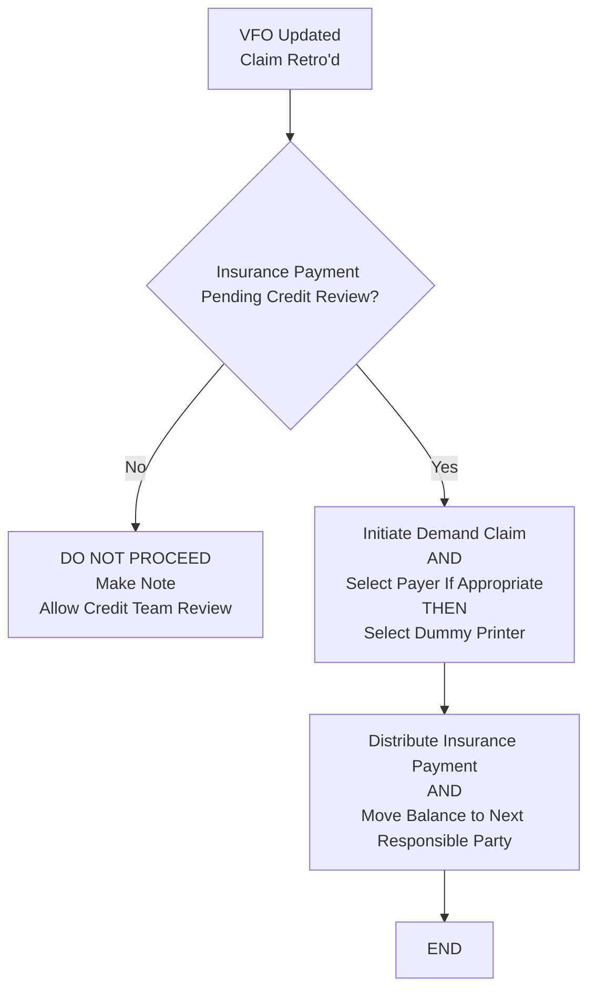

# Demand Claim Workflow

**Version**: 1.0  
**Last Updated**: May 9, 2026  
**Owner**: Shaine Meister  
**Status**: Draft

> **Framework Alignment Check**  
> Before finalizing this workflow, evaluate it against the principles in `core-principles.md` (especially Principles 1–4 and 7). Apply modular structure guidance from `modular-structure.md`, integrate regulatory foundations appropriately from `regulatory-foundations.md`, and optimize for predictable navigation with minimal mental friction per `optimization-standards.md`.  
> This workflow is the **simplified, visual quick-reference companion** to the Demand Claim SOP.

## Process Overview

This workflow guides staff through validating and processing a **Demand Claim** to bill the secondary (or next responsible) payer after primary adjudication, without risking duplicate submission to the primary.

Demand Claims are used when normal claim submission or resubmit would incorrectly target the primary payer.

## Visual Process Flow

**Key Decision Points**
- Are **all three mandatory conditions** met? (Primary adjudicated + Demand required to avoid duplicate + Next payer liability exists)
- Does the current Visit Filing Order support billing the next party?
- Has the primary truly finished processing (payment posted or denial worked)?

**Critical Validation Notes**
- Never initiate a Demand Claim without clear supporting notes from COB / VFO research.
- Demand Claims are consequential — improper use can lead to compliance issues or delayed reimbursement.

**Notes / Tips**
- Always document the specific reason the demand is required.
- Use this workflow when referred from the Visit Filing Order process (Primary Paid + Need to Bill Secondary branch).
- For complex cases (multiple payers, coordination with billing team, etc.), escalate before submission.

## Parent / Related Documents

- **Parent SOP**: `demand-claim.md` (to be created)
- **Related Processes**: 
  - Visit Filing Order SOP & Workflow (trigger point)
  - Registration COB section

## Version History

| Version | Date       | Changes                                      | Author         |
|---------|------------|----------------------------------------------|----------------|
| 1.0     | May 9, 2026| Initial concise workflow created             | Shaine Meister |
