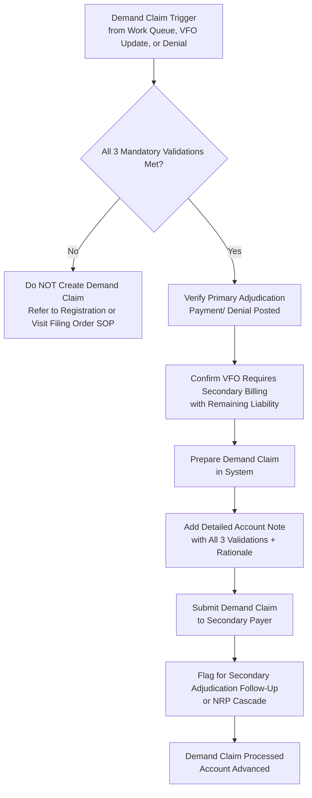

# Demand Claims Workflow

**Version**: 1.0  
**Last Updated**: May 9, 2026  
**Owner**: Shaine Meister  
**Status**: Draft

> **Framework Alignment Check**  
> Before finalizing this workflow, evaluate it against the principles in `core-principles.md` (especially Principles 1–4 and 7). Apply modular structure guidance from `modular-structure.md`, integrate regulatory foundations appropriately from `regulatory-foundations.md`, and optimize for predictable navigation with minimal mental friction per `optimization-standards.md`.  
> This workflow is the **simplified, visual quick-reference companion** to the Demand Claims SOP.

## Process Overview

This workflow guides staff through the controlled, exception-based process of creating a **Demand Claim** to bill a secondary (or subsequent) payer after the primary has adjudicated.

A Demand Claim is **not** routine secondary billing. It is used only when normal resubmission would risk duplicate billing to the primary payer, and timely secondary submission is required.

**Mandatory Validations (All 3 must be true before proceeding)**:
1. Primary payer has already paid or fully processed the claim (adjudication complete).
2. Normal batch/resubmit would risk duplicate submission to the primary.
3. Secondary (or next responsible party) billing is needed per the Visit Filing Order.

## Visual Process Flow: Demand Claim Creation

**Key Decision Points**
- Do **all three** mandatory validations clearly apply?
- Is the primary truly adjudicated (not pending)?
- Will a standard resubmit duplicate bill the primary?
- Does the current Visit Filing Order support billing the next payer now?

**Critical Notes**
- Demand Claims are a high-audit-risk action. Always maintain a strong, traceable rationale.
- If any validation is unclear, escalate before proceeding.
- After submission, follow standard secondary follow-up timelines.

## Parent / Related Documents

- **Parent SOP**: `sops/demand-claims.md` (to be created)
- **Related Processes**:
  - Visit Filing Order SOP & Workflow (especially Primary Paid + Secondary billing branch)
  - Registration Verification & Follow-Up SOP

## Version History

| Version | Date       | Changes                                      | Author          |
|---------|------------|----------------------------------------------|-----------------|
| 1.0     | May 9, 2026| Initial concise workflow created             | Shaine Meister  |