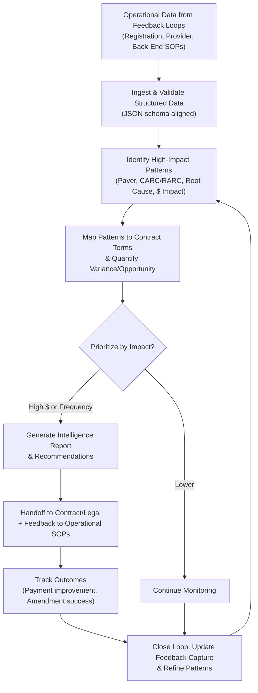

# Contract Intelligence Workflow (Cross-Cutting)

**Version**: 1.0  
**Last Updated**: 2026-05-16  
**Owner**: Shaine Meister  
**Status**: Draft

> **Framework Alignment Check**  
> Before finalizing this workflow, evaluate it against the principles in `core-principles.md` (especially Principles 1–4 and 7). Apply modular structure guidance from `modular-structure.md`, integrate regulatory foundations appropriately from `regulatory-foundations.md`, and optimize for predictable navigation with minimal mental friction per `optimization-standards.md`.  
> This workflow is intended as the **simplified, visual quick-reference companion** to its parent SOP (see `modular-structure.md` – Recommended Design Patterns: SOP + Companion Workflow Pairing).

## Process Overview

This workflow provides a high-level visual flow for ingesting operational data from Feedback Loops, identifying patterns, mapping to contracts, generating intelligence, and closing the loop with operational and contract teams. It supports the self-improving nature of the 3×3 Matrix.

## Visual Process Flow

**Key Decision Points**  
- Which patterns cross the threshold for contract team attention?
- What is the estimated financial/compliance impact?
- How to balance quick wins vs. strategic contract changes?

## Related Documents

- **Parent SOP**: [sops/feedback-loop-contract-intelligence.md](../sops/feedback-loop-contract-intelligence.md) — Full procedures, roles, data standards, and intelligence outputs.
- Governing document: [framework/feedback-loop-framework.md](../framework/feedback-loop-framework.md)
- Operational model pairs (e.g., registration.md) for data sources.

## Version History

| Version | Date       | Changes | Author |
|---------|------------|---------|--------|
| 1.0 | 2026-05-16 | Initial creation as companion to Contract Intelligence SOP on phase-3-enhancements branch. Simple Mermaid flow for data ingestion, pattern identification, contract mapping, and loop closure. | Shaine Meister |

## Feedback Loop & Data Collection Framework

> **Purpose of This Section**  
> This section is intentionally separated from operational steps. It serves as the standardized interface and data mapping layer for future autonomous Revenue Cycle Management systems, analytics platforms, RPA tools, and AI-driven decision engines. It enables clean integration without altering core clinical or administrative workflows.

### Data Capture Points (Structured Fields)
- `workflow_path` (string, required) — Primary flow followed (e.g., Pattern Identification → Contract Mapping)
- `patterns_detected` (array, required) — Key patterns flagged with payer, category, and impact metrics
- `handoff_summary` (object, required) — Structured summary prepared for contract/legal and operational teams
- `outcome_data` (object, optional) — Tracked results of intelligence-driven actions

### Handoff Triggers & Destinations
- **Trigger**: Intelligence report generated with actionable recommendations
  - **Destination**: Contract Manager + relevant operational SOP owners
- **Trigger**: Outcome data available for loop closure
  - **Destination**: feedback-loop-contract-intelligence.md + central analytics

### Contract Intelligence Mapping
- Aggregation of denial and variance data linked to specific contract performance metrics
- Visualization of payer-specific opportunity hotspots
- Closed-loop metrics showing impact of intelligence on revenue and compliance

### Automation Readiness Notes
- Designed for batch or event-driven execution
- Compatible with JSON exports from operational Feedback Loops
- Supports future dashboard or automated alerting
