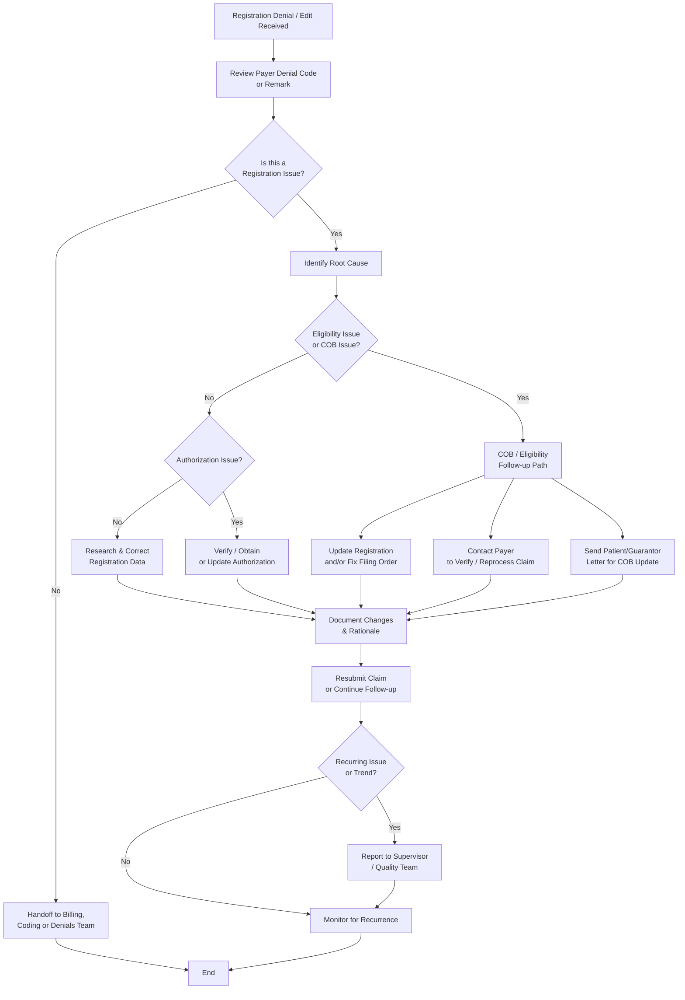

# Registration Verification & Follow-Up Workflow (Back-End)

**Version**: 1.3  
**Last Updated**: May 6, 2026  
**Owner**: Shaine Meister  
**Status**: Draft

> **Framework Alignment Check**  
> Before finalizing this workflow, evaluate it against the principles in `core-principles.md` (especially Principles 1–4 and 7). Apply modular structure guidance from `modular-structure.md`, integrate regulatory foundations appropriately from `regulatory-foundations.md`, and optimize for predictable navigation with minimal mental friction per `optimization-standards.md`.  
> This workflow is intended as the **simplified, visual quick-reference companion** to its parent SOP (see `modular-structure.md` – Recommended Design Patterns: SOP + Companion Workflow Pairing).

## Process Overview

This workflow provides a dynamic visual quick-reference for back-end Revenue Cycle teams handling real-world registration issues triggered by claim denials, billing edits, and work queue items. It emphasizes Coordination of Benefits (COB) variability and clear resolution paths. Use this alongside the full Registration Verification & Follow-Up SOP.

## Visual Process Flow

**Key Decision Points**  
- After reviewing denial/edit: Is this primarily a registration issue? → Guides handoff vs. in-house work.  
- Eligibility or COB issue? → Enter dedicated COB/Eligibility follow-up path with three possible outcomes.  
- Authorization issue? → Resolve or escalate.  
- Recurring issues or high-impact cases? → Escalate and report trends for front-end improvement.

**Notes**  
- The COB / Eligibility path now shows three common real-world resolution outcomes:  
  1. Update registration / fix filing order (internal correction)  
  2. Contact payer to verify or request reprocessing  
  3. Send patient/guarantor letter when COB information needs to be updated by the patient  
- Prioritize based on timely filing deadlines and dollar impact.  
- Refer to the full SOP for detailed research steps and documentation standards.

## Parent SOP

- [registration.md](../sops/registration.md) — Full procedures, roles, quality checks, optimization guidance, and version history for back-end registration follow-up.

## Version History

| Version | Date       | Changes                                                                 | Author          |
|---------|------------|-------------------------------------------------------------------------|-----------------|
| 1.0     | May 6, 2026| Initial front-end focused version created                               | Shaine Meister  |
| 1.1     | May 6, 2026| Revised to align with back-end SOP focus                                | Shaine Meister  |
| 1.2     | May 6, 2026| Updated to denial-driven flow with triage and root cause branches       | Shaine Meister  |
| 1.3     | May 6, 2026| Added explicit COB / Eligibility variability with three resolution outcomes (update registration/filing order, contact payer, send patient letter). Improved visual clarity and decision points while maintaining simplicity. | Shaine Meister  |
