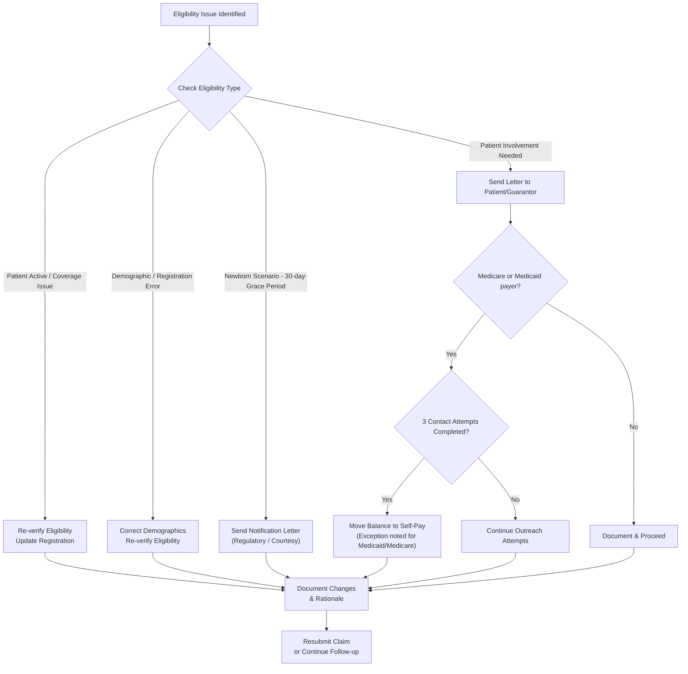
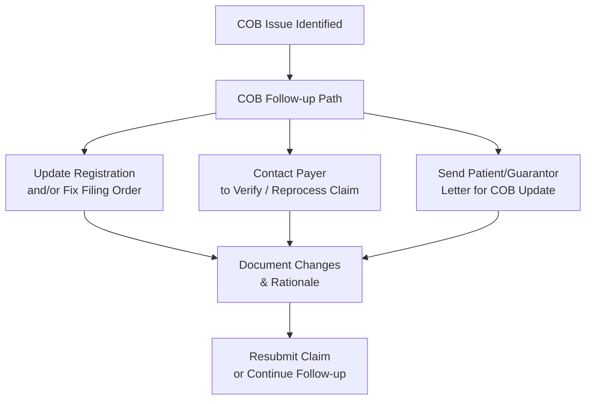
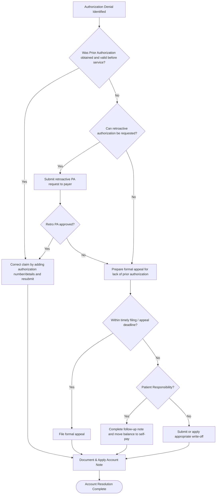

# Registration Verification & Follow-Up Workflow (Back-End)

**Version**: 1.7  
**Last Updated**: May 6, 2026  
**Owner**: Shaine Meister  
**Status**: Draft

> **Framework Alignment Check**  
> Before finalizing this workflow, evaluate it against the principles in `core-principles.md` (especially Principles 1–4 and 7). Apply modular structure guidance from `modular-structure.md`, integrate regulatory foundations appropriately from `regulatory-foundations.md`, and optimize for predictable navigation with minimal mental friction per `optimization-standards.md`.  
> This workflow is intended as the **simplified, visual quick-reference companion** to its parent SOP (see `modular-structure.md` – Recommended Design Patterns: SOP + Companion Workflow Pairing).

## Process Overview

This workflow is split into three focused Visual Process Flows to improve clarity and reduce complexity:
- **Eligibility**
- **Coordination of Benefits (COB)**
- **Authorization**

Each section can be referenced independently while still supporting the overall back-end registration follow-up process. Use alongside the full Registration Verification & Follow-Up SOP.

## Visual Process Flow: Eligibility

## Visual Process Flow: Coordination of Benefits (COB)

## Visual Process Flow: Authorization

**Key Decision Points**  
- Under **Eligibility**: Four distinct scenarios. The 3-contact attempt rule and self-pay move now apply specifically to Medicare/Medicaid payers.  
- Under **COB**: Three resolution outcomes based on required action.  
- Under **Authorization**: Structured decision tree covering prior auth validity, retroactive requests, appeals, timely filing, and patient responsibility vs. write-off.  
- All paths lead to documentation and account resolution.

**Notes**  
- Eligibility diagram now correctly scopes the 3-contact attempt rule to Medicare/Medicaid payers only.  
- Authorization diagram updated: "Update account and close follow-up" changed to "Document & Apply Account Note". Removed root cause feedback loop and final workflow complete node per request.  
- Each category remains independently usable.

## Parent SOP

- [registration.md](../sops/registration.md) — Full procedures, roles, quality checks, optimization guidance, and version history.

## Version History

| Version | Date       | Changes                                                                 | Author          |
|---------|------------|-------------------------------------------------------------------------|-----------------|
| 1.0     | May 6, 2026| Initial front-end focused version created                               | Shaine Meister  |
| 1.1     | May 6, 2026| Revised to align with back-end SOP focus                                | Shaine Meister  |
| 1.2     | May 6, 2026| Denial-driven flow with triage and root cause                           | Shaine Meister  |
| 1.3     | May 6, 2026| Added COB variability with three resolution outcomes                    | Shaine Meister  |
| 1.4     | May 6, 2026| Separated Eligibility, COB, and Authorization into distinct categories  | Shaine Meister  |
| 1.5     | May 6, 2026| Expanded Eligibility with granular scenarios                            | Shaine Meister  |
| 1.6     | May 6, 2026| Refined Eligibility diagram (separated patient letter from self-pay move after 3 contact attempts). Updated Authorization diagram for better real-world flow. |
| 1.7     | May 6, 2026| Made 3-contact attempt rule specific to Medicare/Medicaid payers in Eligibility. Changed Authorization node to "Document & Apply Account Note". Removed root cause feedback and final workflow complete nodes. Updated version and history. | Shaine Meister  |