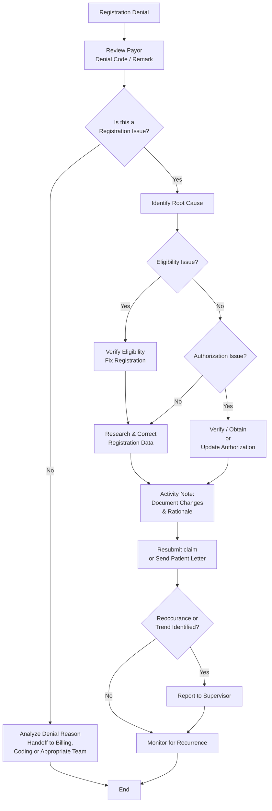

# Registration Verification & Follow-Up Workflow (Back-End)

**Version**: 1.2  
**Last Updated**: May 6, 2026  
**Owner**: Shaine Meister  
**Status**: Draft

> **Framework Alignment Check**  
> Before finalizing this workflow, evaluate it against the principles in `core-principles.md` (especially Principles 1–4 and 7). Apply modular structure guidance from `modular-structure.md`, integrate regulatory foundations appropriately from `regulatory-foundations.md`, and optimize for predictable navigation with minimal mental friction per `optimization-standards.md`.  
> This workflow is intended as the **simplified, visual quick-reference companion** to its parent SOP (see `modular-structure.md` – Recommended Design Patterns: SOP + Companion Workflow Pairing).

## Process Overview

This workflow provides a dynamic visual quick-reference for back-end Revenue Cycle teams handling real-world registration issues triggered by claim denials, billing edits, and work queue items. It shows the flow from denial receipt through triage, root cause analysis, research & correction, and resolution — with clear decision points for eligibility vs. authorization issues and escalation paths. Use this alongside the full Registration Verification & Follow-Up SOP.

## Visual Process Flow

**Key Decision Points**  
- After reviewing denial/edit: Is this primarily a registration issue? (Guides handoff vs. in-house resolution)  
- Eligibility issue identified? → Re-verify and correct before releasing.  
- Authorization issue present? → Attempt resolution or escalate promptly.  
- Recurring issues or high-impact cases? → Escalate and feed into trend reporting for front-end improvement.

**Notes**  
- This diagram reflects common real-world A/R registration denial scenarios.  
- Prioritize based on timely filing deadlines and dollar impact.  
- Refer to the full SOP for detailed research steps, documentation standards, and regulatory considerations.

## Parent SOP

- [registration.md](../sops/registration.md) — Full procedures, roles, quality checks, optimization guidance, and version history for back-end registration follow-up.

## Version History

| Version | Date       | Changes                                                                 | Author          |
|---------|------------|-------------------------------------------------------------------------|-----------------|
| 1.0     | May 6, 2026| Initial front-end focused version created                               | Shaine Meister  |
| 1.1     | May 6, 2026| Revised to align with back-end SOP focus                                | Shaine Meister  |
| 1.2     | May 6, 2026| Updated Visual Process Flow to be more dynamic: starts from denial/edit receipt, includes explicit triage decision point, root cause categorization, eligibility vs authorization branches, and trend/escalation loop. | Shaine Meister  |
