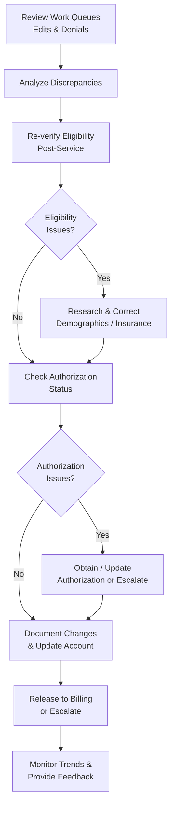

# Registration Verification & Follow-Up Workflow (Back-End)

**Version**: 1.1  
**Last Updated**: May 6, 2026  
**Owner**: Shaine Meister  
**Status**: Draft

> **Framework Alignment Check**  
> Before finalizing this workflow, evaluate it against the principles in `core-principles.md` (especially Principles 1–4 and 7). Apply modular structure guidance from `modular-structure.md`, integrate regulatory foundations appropriately from `regulatory-foundations.md`, and optimize for predictable navigation with minimal mental friction per `optimization-standards.md`.  
> This workflow is intended as the **simplified, visual quick-reference companion** to its parent SOP (see `modular-structure.md` – Recommended Design Patterns: SOP + Companion Workflow Pairing).

## Process Overview

This workflow provides a simplified visual quick-reference for back-end Revenue Cycle teams performing **post-service registration verification and follow-up**. It focuses on work queue review, discrepancy identification, eligibility re-verification, research & correction, authorization follow-up, documentation, and handoff to billing. Use this as your primary day-to-day tool. Refer to the full Registration Verification & Follow-Up SOP for detailed procedures, regulatory context, quality checks, and troubleshooting.

## Visual Process Flow

**Key Decision Points**  
- Eligibility issues or coverage gaps identified after re-verification → Research and correct information before releasing the account.  
- Authorization problems (missing, expired, or denied) → Attempt resolution or escalate promptly to protect timely filing and revenue.  
- Recurring issues, high-dollar impact, or complex cases → Escalate to supervisor and document for trend analysis and front-end feedback.

**Notes**  
- This diagram represents the primary back-end flow with the most common branches.  
- Prioritize work based on timely filing deadlines and financial impact.  
- The full SOP contains detailed research steps, documentation standards, and regulatory considerations.

## Parent SOP

- [registration.md](../sops/registration.md) — The authoritative source with full step-by-step procedures, roles & responsibilities, quality checks, optimization guidance, and version history.

## Version History

| Version | Date       | Changes                                              | Author          |
|---------|------------|------------------------------------------------------|-----------------|
| 1.0     | May 6, 2026| Initial front-end focused version created            | Shaine Meister  |
| 1.1     | May 6, 2026| Revised to align with back-end SOP: post-service work queue management, eligibility re-verification, correction, authorization follow-up, and trend monitoring | Shaine Meister  |
