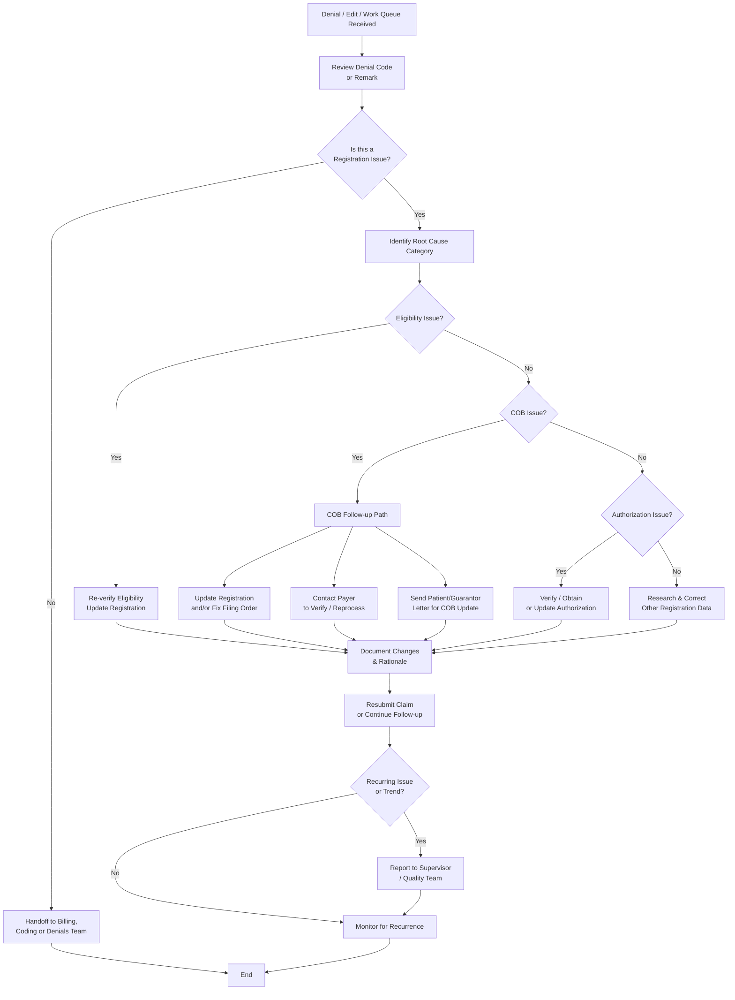

# Registration Verification & Follow-Up Workflow (Back-End)

**Version**: 1.4  
**Last Updated**: May 6, 2026  
**Owner**: Shaine Meister  
**Status**: Draft

> **Framework Alignment Check**  
> Before finalizing this workflow, evaluate it against the principles in `core-principles.md` (especially Principles 1–4 and 7). Apply modular structure guidance from `modular-structure.md`, integrate regulatory foundations appropriately from `regulatory-foundations.md`, and optimize for predictable navigation with minimal mental friction per `optimization-standards.md`.  
> This workflow is intended as the **simplified, visual quick-reference companion** to its parent SOP (see `modular-structure.md` – Recommended Design Patterns: SOP + Companion Workflow Pairing).

## Process Overview

This workflow provides a clear, simplified visual reference for back-end Revenue Cycle teams. It separates **Eligibility**, **Coordination of Benefits (COB)**, and **Authorization** as distinct issue categories with their own resolution paths. Use this alongside the full Registration Verification & Follow-Up SOP.

## Visual Process Flow

**Key Decision Points**  
- After reviewing denial/edit: Is this primarily a registration issue?  
- Root cause category: Separate paths for **Eligibility**, **COB**, and **Authorization**.  
- COB path has three distinct resolution outcomes based on what action is needed.  
- Recurring issues → Escalate and report for front-end improvement.

**Notes**  
- **Eligibility**, **COB**, and **Authorization** are now treated as three distinct categories with dedicated resolution paths.  
- The COB path clearly shows the three common real-world outcomes:  
  1. Internal update to registration / filing order  
  2. Contact payer for verification or reprocessing  
  3. Send letter to patient/guarantor when they need to update COB information  
- Keep the diagram simple while reflecting real A/R decision-making.

## Parent SOP

- [registration.md](../sops/registration.md) — Full procedures, roles, quality checks, optimization guidance, and version history.

## Version History

| Version | Date       | Changes                                                                 | Author          |
|---------|------------|-------------------------------------------------------------------------|-----------------|
| 1.0     | May 6, 2026| Initial front-end focused version created                               | Shaine Meister  |
| 1.1     | May 6, 2026| Revised to align with back-end SOP focus                                | Shaine Meister  |
| 1.2     | May 6, 2026| Denial-driven flow with triage and root cause                           | Shaine Meister  |
| 1.3     | May 6, 2026| Added COB variability with three resolution outcomes                    | Shaine Meister  |
| 1.4     | May 6, 2026| Separated Eligibility, COB, and Authorization into three distinct category paths for clearer visual flow and decision-making. | Shaine Meister  |
