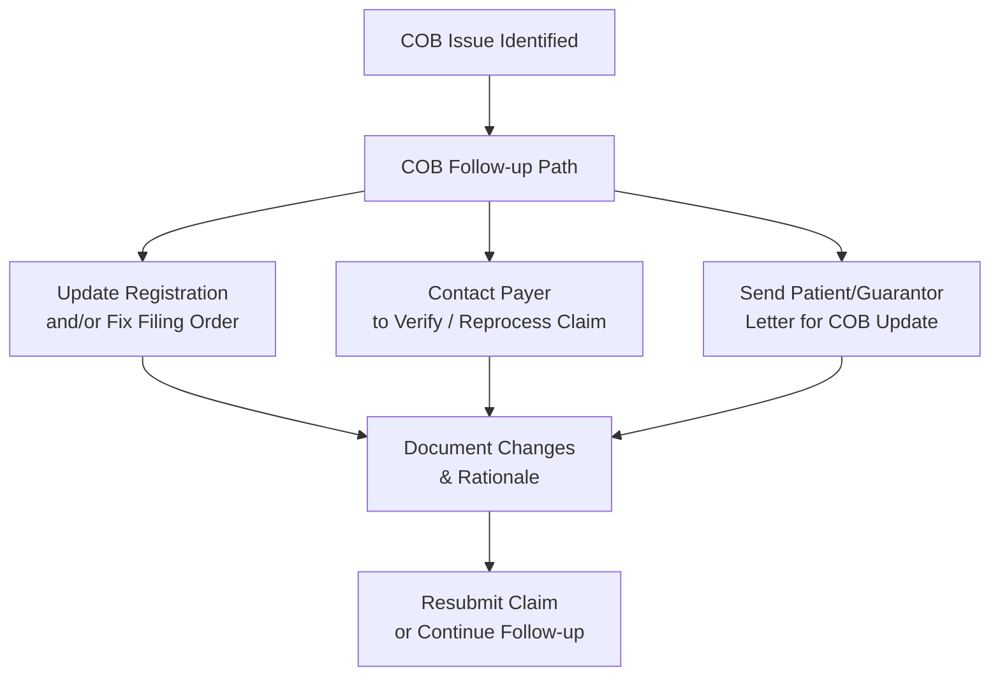
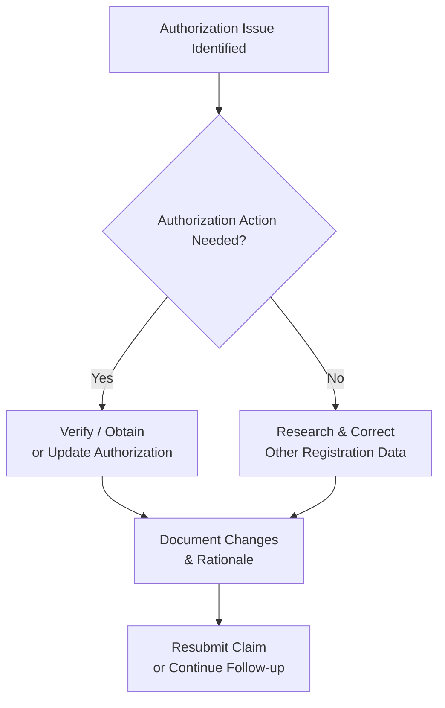

# Registration Verification & Follow-Up Workflow (Back-End)

**Version**: 1.6  
**Last Updated**: May 6, 2026  
**Owner**: Shaine Meister  
**Status**: Draft

> **Framework Alignment Check**  
> Before finalizing this workflow, evaluate it against the principles in `core-principles.md` (especially Principles 1–4 and 7). Apply modular structure guidance from `modular-structure.md`, integrate regulatory foundations appropriately from `regulatory-foundations.md`, and optimize for predictable navigation with minimal mental friction per `optimization-standards.md`.  
> This workflow is intended as the **simplified, visual quick-reference companion** to its parent SOP (see `modular-structure.md` – Recommended Design Patterns: SOP + Companion Workflow Pairing).

## Process Overview

This workflow is split into three focused Visual Process Flows to improve clarity and reduce complexity:
- **Eligibility**
- **Coordination of Benefits (COB)**
- **Authorization**

Each section can be referenced independently while still supporting the overall back-end registration follow-up process. Use alongside the full Registration Verification & Follow-Up SOP.

## Visual Process Flow: Eligibility

```mermaid
flowchart TD
    A[Eligibility Issue Identified] --> B{Check Eligibility Type}
    
    B -->|Patient Active / Coverage Issue| B1[Re-verify Eligibility<br/>Update Registration]
    B -->|Demographic / Registration Error| B2[Correct Demographics<br/>Re-verify Eligibility]
    B -->|Newborn Scenario (30-day Grace Period)| B3[Send Notification Letter<br/>(Regulatory / Courtesy)]
    B -->|Patient Involvement Needed| B4[Send Letter to Patient/Guarantor<br/>Move to Self-Pay<br/>(Exception: Medicaid/Medicare)]
    
    B1 --> C[Document Changes<br/>& Rationale]
    B2 --> C
    B3 --> C
    B4 --> C
    
    C --> D[Resubmit Claim<br/>or Continue Follow-up]
```

## Visual Process Flow: Coordination of Benefits (COB)



## Visual Process Flow: Authorization



**Key Decision Points**  
- Under **Eligibility**: Four distinct scenarios (Patient Active/Coverage, Demographic Error, Newborn Grace Period, Patient Involvement).  
- Under **COB**: Three resolution outcomes based on what action is required.  
- Under **Authorization**: Clear yes/no decision on whether authorization work is needed.  
- All paths converge on documentation and resubmission/follow-up.

**Notes**  
- The workflow is now split into three focused diagrams for better readability and maintainability.  
- Each category (Eligibility, COB, Authorization) can be reviewed independently.  
- This structure reduces overlap and complexity while preserving real-world decision points.

## Parent SOP

- [registration.md](../sops/registration.md) — Full procedures, roles, quality checks, optimization guidance, and version history.

## Version History

| Version | Date       | Changes                                                                 | Author          |\n|---------|------------|-------------------------------------------------------------------------|-----------------|
| 1.0     | May 6, 2026| Initial front-end focused version created                               | Shaine Meister  |\n| 1.1     | May 6, 2026| Revised to align with back-end SOP focus                                | Shaine Meister  |\n| 1.2     | May 6, 2026| Denial-driven flow with triage and root cause                           | Shaine Meister  |\n| 1.3     | May 6, 2026| Added COB variability with three resolution outcomes                    | Shaine Meister  |\n| 1.4     | May 6, 2026| Separated Eligibility, COB, and Authorization into distinct categories  | Shaine Meister  |\n| 1.5     | May 6, 2026| Expanded Eligibility with granular scenarios                            | Shaine Meister  |\n| 1.6     | May 6, 2026| Restructured into three separate Visual Process Flow sections (Eligibility, COB, Authorization) to fix the layout issues and reduce complexity. Version maintained at 1.6 per request. | Shaine Meister  |
