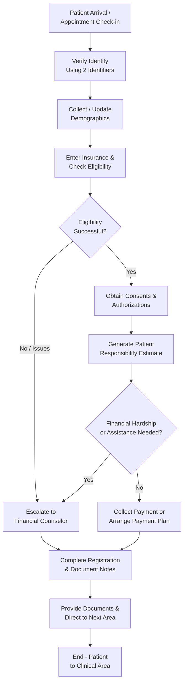

# Registration Workflow

**Version**: 1.0  
**Last Updated**: May 6, 2026  
**Owner**: Shaine Meister  
**Status**: Draft

> **Framework Alignment Check**  
> Before finalizing this workflow, evaluate it against the principles in `core-principles.md` (especially Principles 1–4 and 7). Apply modular structure guidance from `modular-structure.md`, integrate regulatory foundations appropriately from `regulatory-foundations.md`, and optimize for predictable navigation with minimal mental friction per `optimization-standards.md`.  
> This workflow is intended as the **simplified, visual quick-reference companion** to its parent SOP (see `modular-structure.md` – Recommended Design Patterns: SOP + Companion Workflow Pairing).

## Process Overview

This workflow provides a simplified, visual quick-reference for the day-to-day Patient Registration process. It focuses on the core flow from patient arrival through completion and handoff, highlighting the most common decision points and escalation paths. Use this as your primary day-to-day tool. Refer to the full Registration SOP for detailed procedures, regulatory context, quality checks, and troubleshooting.

## Visual Process Flow

Keep the diagram simple and focused on the main flow. Avoid unnecessary complexity or excessive branching unless essential for understanding.

**Key Decision Points**  
- Eligibility check fails or returns issues → Escalate early to Financial Counselor to prevent downstream denials and rework.  
- Patient expresses financial hardship or requests assistance → Immediate escalation to Financial Counselor.  
- Emergency Department registrations → Maintain EMTALA compliance (medical screening exam offered regardless of payment ability) throughout the process.

**Notes**  
- This diagram represents the primary happy path with the most frequent branches.  
- The full SOP contains the complete step-by-step details, regulatory notes, and optimization guidance.

## Parent SOP

- [registration.md](../sops/registration.md) — The authoritative documented source containing full procedures, roles, regulatory context, quality checks, and version history.

## Version History

| Version | Date       | Changes                              | Author          |
|---------|------------|--------------------------------------|-----------------|
| 1.0     | May 6, 2026| Initial companion workflow created as model for the framework | Shaine Meister  |