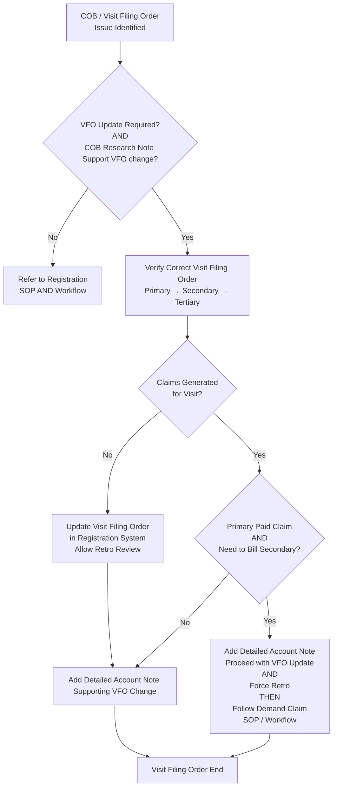

# Visit Filing Order Workflow

**Version**: 1.3  
**Last Updated**: May 9, 2026  
**Owner**: Shaine Meister  
**Status**: Draft

> **Framework Alignment Check**  
> Before finalizing this workflow, evaluate it against the principles in `core-principles.md` (especially Principles 1–4 and 7). Apply modular structure guidance from `modular-structure.md`, integrate regulatory foundations appropriately from `regulatory-foundations.md`, and optimize for predictable navigation with minimal mental friction per `optimization-standards.md`.  
> This workflow is intended as the **simplified, visual quick-reference companion** to its parent SOP (see `modular-structure.md` – Recommended Design Patterns: SOP + Companion Workflow Pairing). It expands the “correct filing order (internal fix)” action from the Registration Verification & Follow-Up COB process.

## Process Overview

This workflow provides a clear, repeatable process for reviewing whether a Visit Filing Order (VFO) update is required and supported by COB research. It emphasizes validation before making changes, especially when claims have already been generated.

**Key Principle**: Changing the Visit Filing Order is consequential. Updates should only proceed when supported by documented COB research notes and proper validation. When claims have been generated (especially if the primary has paid), additional steps including retro review and potential handoff to Demand Claims processes are required.

## Visual Process Flow: Visit Filing Order Review & Update

**Key Decision Points**
- Is a VFO update required **and** supported by COB research documentation?
- Have claims already been generated for this visit?
- If claims exist: Has the primary payer adjudicated/paid, and is there a need to bill secondary?

**Notes / Tips**
- Always verify insurance coverage against the **exact date of service**.
- A "COB Research Note" must support the proposed VFO change before proceeding with an update.
- When claims have been generated and the primary has paid, follow the Demand Claim process after forcing retro review.
- Maintain clear documentation of the rationale for any VFO change.
- Use this workflow in conjunction with the Registration Verification & Follow-Up SOP (COB section).

## Parent / Related Documents

- **Parent SOP**: [visit-filing-order.md](../sops/visit-filing-order.md)
- **Related Process**: Coordination of Benefits (COB) section in [registration.md](../sops/registration.md)
- **Demand Claim SOP & Workflow** (implemented): [demand-claim.md](../sops/demand-claim.md) and [demand-claim-workflow.md](../workflows/demand-claim-workflow.md)

## Version History

| Version | Date       | Changes                                                                 | Author          |
|---------|------------|-------------------------------------------------------------------------|-----------------|
| 1.0     | May 8, 2026| Initial concise workflow created as extension of Registration COB process | Shaine Meister  |
| 1.1     | May 8, 2026| Refined Process Overview, added emphasis on consequential nature of VFO changes, improved Key Decision Points and Notes for better usability and validation focus | Shaine Meister  |
| 1.2     | May 8, 2026| Major revision to align with simplified decision flow provided. Added validation gate (VFO Update Required + COB Research Note support), claims-generated branching, Primary Paid + Secondary billing path with Demand Claim handoff, and explicit handling of retro review | Shaine Meister  |
| 1.3     | May 9, 2026| Implemented Areas for Improvement and Recommendations: restructured Mermaid diagram for cleaner syntax and explicit paths (removed bare node reference K by defining it once and routing I and J-No branches clearly to it), updated Related Documents to replace outdated Future note with links to the now-implemented Demand Claim pair, updated Version, Last Updated, and added implementation details to Version History. | Shaine Meister  |