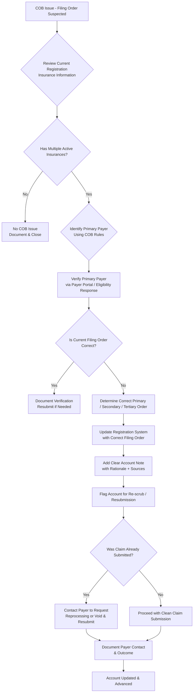

# Visit Filing Order Workflow

**Version**: 1.0  
**Last Updated**: May 8, 2026  
**Owner**: Shaine Meister  
**Status**: Draft

> **Framework Alignment Check**  
> Before finalizing this workflow, evaluate it against the principles in `core-principles.md` (especially Principles 1–4 and 7). Apply modular structure guidance from `modular-structure.md`, integrate regulatory foundations appropriately from `regulatory-foundations.md`, and optimize for predictable navigation with minimal mental friction per `optimization-standards.md`.  
> This workflow is intended as the **simplified, visual quick-reference companion** to its parent SOP (see `modular-structure.md` – Recommended Design Patterns: SOP + Companion Workflow Pairing). It expands the “correct filing order (internal fix)” action from the Registration Verification & Follow-Up COB process.

## Process Overview

This workflow provides a clear, repeatable process for determining and correcting the correct primary, secondary, and tertiary payer filing order for a specific visit/encounter. It is used when a COB issue has been triaged in the Registration follow-up process and the appropriate action is to fix the filing order internally.

The goal is to ensure claims are submitted to the correct primary payer first, reducing denials, rejections, and delays while maintaining compliance with Coordination of Benefits rules.

## Visual Process Flow: Determining & Correcting Visit Filing Order

**Key Decision Points**
- Does the patient have multiple active insurances on the date of service?
- What are the applicable COB rules for this combination of payers? (Birthday rule, employer coverage, Medicare Secondary Payer rules, etc.)
- Is the current filing order in the system correct?
- Has the claim already been submitted to the wrong primary payer?

**Notes / Tips**
- Always verify against the **date of service**, not current coverage.
- Document the specific COB rule used to determine primary payer.
- When in doubt on complex COB situations (e.g., multiple employer plans, Medicare + other coverage), escalate to a supervisor or COB specialist before updating.
- Use this workflow in conjunction with the broader COB section in the Registration Verification & Follow-Up SOP.

## Parent / Related Documents

- **Parent SOP** (created alongside): [visit-filing-order.md](../sops/visit-filing-order.md)
- **Related Process**: Coordination of Benefits (COB) section in [registration.md](../sops/registration.md) — specifically the “Update registration and/or correct filing order (internal fix)” action.

## Version History

| Version | Date       | Changes                                      | Author          |
|---------|------------|----------------------------------------------|-----------------|
| 1.0     | May 8, 2026| Initial concise workflow created as extension of Registration COB process | Shaine Meister (with Grok) |